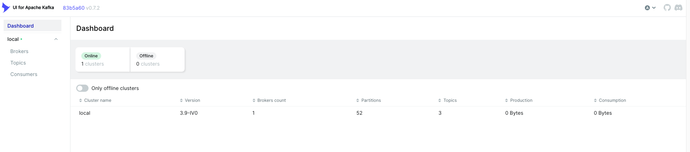
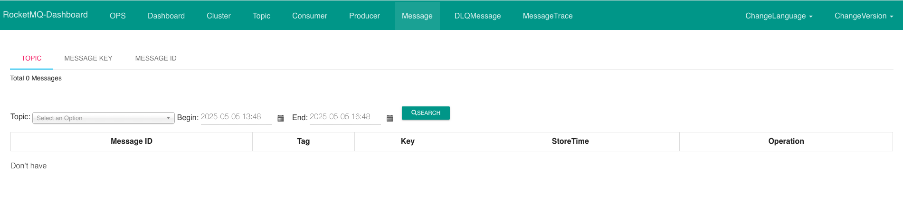

# bet-service

<!-- TOC -->
* [bet-service](#bet-service)
  * [Why: Purpose of the application](#why-purpose-of-the-application)
  * [How: How to run it and utilities](#how-how-to-run-it-and-utilities)
    * [Running application in docker](#running-application-in-docker)
    * [Running application in local](#running-application-in-local)
    * [Kafka and RocketMQ UI](#kafka-and-rocketmq-ui)
  * [Where: Classes of interest](#where-classes-of-interest)
  * [What: Architecture explanation](#what-architecture-explanation)
  * [TODO: next features](#todo-next-features)
  * [Who: Alvaro Longueira](#who-alvaro-longueira)
<!-- TOC -->

## Why: Purpose of the application
Application that exposes a REST API to notify the result of a bet

It sends an event to kafka topic `event-outcomes` with that information

That event is received, search all the bets that match that event, and notify them to rocketMQ topic `bet-settlements`

## How: How to run it and utilities
This is a multimodule java application. There are two ways to run it

### Running application in docker
1) In the root folder of the project, run command
```bash
mvn clean install -DskipTests
```

2) Build and run all the images in docker
```bash
cd ./docker
docker compose up
````

3) Send a valid request to the application
```bash
curl --location 'http://localhost:8080/event_winner' \
--header 'Content-Type: application/json' \
--data '{
    "eventId": "soccer",
    "eventName": "soccer_match",
    "winnerId": "lion"
}'
```


### Running application in local
1) Open and run class [BetServiceApplication.java](main/src/main/java/com/alvarolongueira/bet/service/BetServiceApplication.java)

2) Optional: Build and run all the images in docker except `app` when other services (kafka, rocketMQ) are not available

3) Send a valid request to the application
```bash
curl --location 'http://localhost:8080/event_winner' \
--header 'Content-Type: application/json' \
--data '{
    "eventId": "soccer",
    "eventName": "soccer_match",
    "winnerId": "lion"
}'
```

### Kafka and RocketMQ UI
In docker compose there are two UI to monitorize events, one by type

* Kafka UI http://localhost:9081/


* RocketMQ UI http://localhost:9082/


## Where: Classes of interest
* [BetServiceApplication.java](main/src/main/java/com/alvarolongueira/bet/service/BetServiceApplication.java) is the main class to run the application
* [IntegrationTest.java](main/src/test/java/com/alvarolongueira/bet/service/main/IntegrationTest.java) is a class test that validates the happy path
  * Note: As there is no Testcontainer for RocketMQ, it was used a mockbean for the producer
* In the logs, you can search by the key `CUSTOM-TRACE-LOG` to review the flow

## What: Architecture explanation
Although this has been built as a single application, it is prepared to be separated in two different applications

* Module `main` has only the runner class and the properties but the code is in the other two modules
* Module `rest-api` is responsible for receiving all the Api requests and transform them to Kafka events 
* Module `manager` has the database and the business logic for each received event. In this case, receive a kafka event, search all the matched bets and send a new event to RocketMQ with that list 
* Some data is preloaded in database when application starts [data.sql](main/src/main/resources/data.sql). With this data and the provided example in the curl, there are three bets that match
 
## TODO: next features
Things that should be done but aren't because of time

* RocketMQ is not completely configured (this is a must)
* Open Api spec and Api generation
* Error handling and exceptions
* Retries
* Unit tests
* Integration tests with more validations and unsuccessfully scenarios
* RocketMQ testcontainer
* Improve logs

## Who: Alvaro Longueira
* **Alvaro Longueira** - [GitHub](https://github.com/alvarolongueira)
